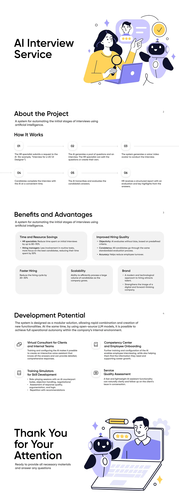

# InterVizo — AI-Powered Interview Platform

**InterVizo** is a full-stack web application for automating job interviews using AI. HR specialists create interview
templates, share a link with candidates, and the platform conducts the interview autonomously: it voices questions via
AI speech synthesis, captures and transcribes candidate answers, and produces a scored report — all without a human
moderator in the room.

Video DEMO - https://drive.google.com/file/d/1_IsjGTrcDBVaYBVQWGZ4ri7YgVQgpBML/view

---

## Tech Stack

| Layer         | Technology                                                        |
| ------------- | ----------------------------------------------------------------- |
| Framework     | Next.js 15 (App Router, Server Components)                        |
| Language      | JavaScript (ES2024)                                               |
| UI            | React 19, SCSS Modules, clsx                                      |
| Auth          | NextAuth v4 — Credentials + Google OAuth                          |
| Database      | MongoDB + Mongoose                                                |
| AI / Speech   | OpenAI GPT-4o (generation & scoring), ElevenLabs TTS, Whisper ASR |
| File Storage  | Firebase Cloud Storage                                            |
| Data Fetching | SWR                                                               |
| Forms         | Zod validation                                                    |
| Drag & Drop   | @dnd-kit (sortable question editor)                               |
| Carousel      | Swiper.js                                                         |

---

## Key Features

- **Interview Builder** — create structured interviews with drag-and-drop question sections; generate questions from a
  job description using GPT-4o in one click
- **AI Interview Room** — the platform reads questions aloud (ElevenLabs), records the candidate's video/audio,
  transcribes answers via Whisper ASR, and triggers the next question automatically based on voice activity
- **Automated Scoring** — GPT-4o evaluates each transcribed answer on a 0–5 scale and produces a total candidate score
- **Candidate Management** — track all candidates per interview, view individual scores and transcripts, delete records
- **Multi-role Auth** — `hr`, `boss`, and `admin` roles; JWT-based sessions with 30-day TTL; Google OAuth auto-links
  existing accounts
- **Public Invite Links** — candidates access their interview via a shareable `/connect/[id]` link, no account required
- **Responsive UI** — skeleton loaders, toast notifications, progress popups, confirmation dialogs

---

## Application Pages

| Route                            | Purpose                                             |
| -------------------------------- | --------------------------------------------------- |
| `/`                              | Dashboard — recent interviews slider + results list |
| `/login`                         | Sign in (email/password or Google)                  |
| `/registration`                  | Create account                                      |
| `/profile`                       | User profile and session management                 |
| `/interviews`                    | Browse all interviews with search and filters       |
| `/interviews/[id]`               | Interview details + candidate list                  |
| `/interviews/[id]/[candidateId]` | Individual candidate result with scores             |
| `/add-new-interview`             | Create or edit an interview (AI-assisted)           |
| `/connect/[id]`                  | Public candidate entry form (no auth required)      |
| `/room/[id]`                     | Live interview room — video + AI questions          |
| `/scoring`                       | Post-interview scoring trigger                      |
| `/scoring/result`                | Final scored report                                 |

---

## Architecture Overview

```
src/
├── app/                  # Next.js App Router (pages + API routes)
│   └── api/
│       ├── auth/         # NextAuth + registration
│       ├── interview/    # CRUD for interview templates
│       ├── candidate/    # CRUD for candidate records
│       ├── firebase/     # Audio upload/delete via Firebase
│       ├── generate-interview/  # GPT-4o question generation
│       └── score/        # GPT-4o answer scoring
├── components/           # 60+ React components (UI, forms, room, scoring)
├── context/              # 6 React Contexts (Session, Popup, Camera, Video, Progress, ProgressUI)
├── hooks/                # 7 custom hooks (useInterview, useProgressStorage, useWhisperVoice …)
├── lib/                  # Utilities: mongodb, firebase, fetcher, slugify, debounce …
├── models/               # Mongoose schemas: User, Interview, Candidate
└── styles/               # Global + component-level SCSS
```

**Data flow (interview room):**

1. `ProgressContext` orchestrates the interview steps
2. `CameraContext` captures video and streams audio to the ASR WebSocket
3. `useWhisperVoice` detects end-of-speech and signals the next question
4. `VideoContext` plays AI reaction video between steps
5. On completion, the client posts to `/api/score` → GPT-4o returns per-answer scores

---

## Getting Started

```bash
# 1. Clone and install
npm install

# 2. Configure environment
cp .env.example .env.local
# Fill in: MONGODB_URI, NEXTAUTH_SECRET, OPENAI_API_KEY,
#          ELEVENLABS_API_KEY, FIREBASE_*, GOOGLE_CLIENT_*

# 3. Run in development
npm run dev

# 4. Build for production
npm run build && npm start
```

**Required external services:** MongoDB Atlas (or local), OpenAI API, ElevenLabs API, Firebase project with Cloud
Storage, Google Cloud OAuth credentials.


